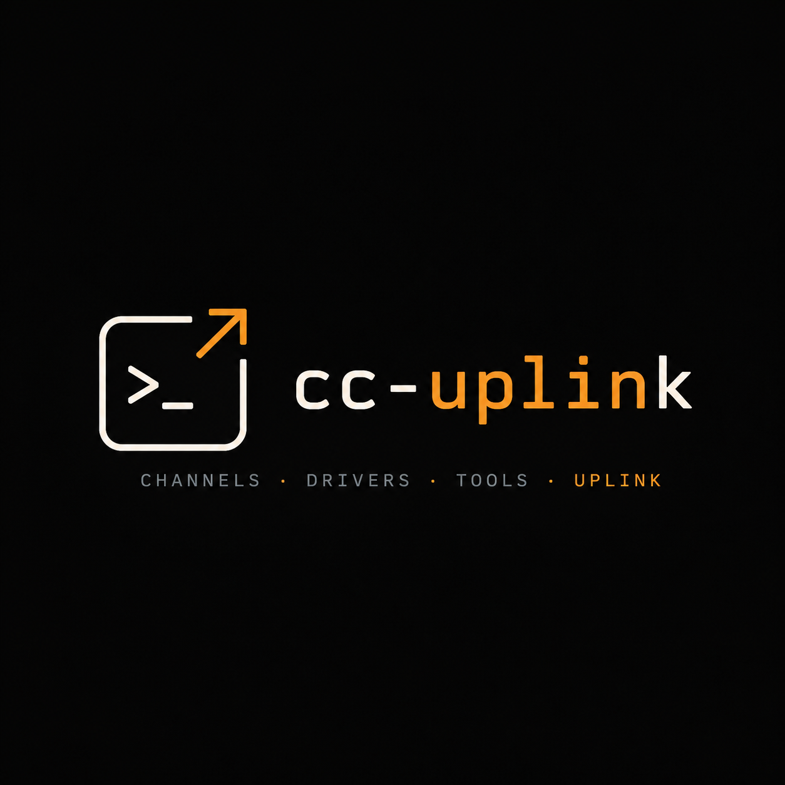

<p align="center"></p>

# cc-uplink

[](https://github.com/XBlueSky/cc-uplink/actions/workflows/ci.yml)
[](https://github.com/XBlueSky/cc-uplink/releases)
[](LICENSE)

**Website:** https://cc-uplink.pages.dev

Claude Code's unified outbound channel layer: one Rust binary, one stdio MCP
server, **seven fixed tools** — with pluggable drivers underneath. Adding a
driver never adds a tool, so your tool/skill listing budget stays flat no
matter how many ways Claude can reach the outside world.

| Tool | Purpose |
|---|---|
| `channel_list()` | Enumerate channels across drivers |
| `channel_describe(channel, op?)` | On-demand JSON Schema for an op |
| `channel_send(channel, message, opts?)` | Async message (tmux: inject → verify → Enter, evidence-bearing receipt); `image:*` channels are act-only, so `channel_send` is rejected there — use `channel_act` with `generate`/`edit` |
| `channel_observe(channel, op, args)` | Read-only capability call (ops with `mutating: false` — `read`, `await_idle`) |
| `channel_act(channel, op, args)` | Mutating capability call (ops with `mutating: true` — `type`, `keys`, `ask`, `label`, image `generate`/`edit`) |
| `channel_recv(cursor?)` | Drain inbound envelope audit log |
| `channel_doctor()` | Aggregated per-driver diagnostics |

Calling an op through the wrong tool (a mutating op via `channel_observe`, or
vice versa) is rejected, naming the right tool — this split is what lets
Claude Code's own MCP permission layer auto-allow "look" while gating "act".

## Channels

- **`tmux:%3` / `tmux:<label>`** — talk to whatever runs in another tmux pane
  (Codex CLI, another Claude, a shell), or type into a raw console (`nc`,
  `telnet`, serial) with no shell at all. Control-mode-first (`tmux -C`),
  event-driven verify; peers install nothing — the message envelope teaches
  them how to reply with plain `tmux send-keys`. Ops: `read`, `type`
  (read-guarded, literal fire-and-forget console injection), `keys`
  (read-guarded), `label`, `await_idle`, `ask` (mechanized round-trip that
  captures everything the peer printed since your question). Write ops are
  gated by [permission tier](#permission-tiers).
- **`image:openai`** — direct OpenAI Images API (`gpt-image-1`), rustls only,
  key from env. Ops: `generate`, `edit`. Files land in `./uplink-images/`,
  absolute paths returned.
- **`image:codex`** — borrows Codex CLI's built-in imagegen via
  `codex exec --sandbox workspace-write` (ChatGPT login, no API key needed).
  Ops: `generate`, `edit`.

## Permission tiers

tmux write ops are deny-by-default and tiered — every pane starts
**observer** until a human grants more:

| Tier | Grants | For |
|---|---|---|
| `observer` (default) | `read`, `await_idle` (+ ungated list/describe/doctor/recv) | any pane, unfamiliar panes |
| `operator` | + `send`, `ask`, `type`, benign keys, `label` | consoles and peers you drive |
| `godmode` | + dangerous key chords (`C-c`, `C-d`, …) | breakglass |

Grants are human-only: a pane option (`tmux set -p @uplink_profile
operator`) or a `write_allow` glob in `config.toml`. The driver never writes
these itself. Get the `prefix+g` grant menu and the border badge that shows
each pane's tier at a glance:

```bash
cc-uplink tmux-snippet > ~/.config/tmux/uplink.tmux
echo 'source-file ~/.config/tmux/uplink.tmux' >> ~/.tmux.conf
```

Full reference: [docs/configuration.md](docs/configuration.md).

## Install

### Claude Code plugin (recommended)

```
/plugin marketplace add XBlueSky/cc-uplink
/plugin install cc-uplink@cc-uplink
```

The plugin ships the `uplink` skill and registers the MCP server. On first
connection `scripts/launcher.sh` downloads the release binary pinned in
`.claude-plugin/server-version` for your platform (static musl Linux or
macOS, x86_64/aarch64), verifies its sha256, and caches it in the plugin
data dir — the skill and the binary it describes can never version-skew.
Set `CC_UPLINK_BIN=/path/to/local/build` to bypass pinning during
development.

### Manual (any other MCP client, or no plugins)

Prebuilt binaries are on the
[Releases page](https://github.com/XBlueSky/cc-uplink/releases) — Linux
builds are fully static musl (x86_64/aarch64, any distro with kernel ≥ 3.2),
plus macOS (x86_64/aarch64):

```bash
curl -fsSL https://github.com/XBlueSky/cc-uplink/releases/latest/download/cc-uplink-x86_64-unknown-linux-musl.tar.gz | tar xz
claude mcp add -s user cc-uplink -- "$PWD/cc-uplink" serve
```

Or build from source:

```bash
cargo build --release
claude mcp add -s user cc-uplink -- "$PWD/target/release/cc-uplink" serve
```

(For a non-Claude MCP client, point it at `cc-uplink serve` however it
registers stdio servers.) The manual path registers the tools only; to get
the `uplink` skill without the plugin, copy
`plugins/cc-uplink/skills/uplink/SKILL.md` to `~/.claude/skills/uplink/`.

Requirements: tmux ≥ 3.2 for the full tmux feature set (3.5a is the reference
environment; a one-shot CLI fallback covers older tmux), `OPENAI_API_KEY` for
`image:openai`, `@openai/codex` ≥ 0.142 + `codex login` for `image:codex`.

## Configuration

Optional `~/.config/cc-uplink/config.toml` enables/disables drivers and names
the env var holding the OpenAI key. Full reference:
[docs/configuration.md](docs/configuration.md).

## CLI

The same binary drives every channel with no LLM involved — `doctor`, `send`,
`invoke`, `log --follow`. Full reference: [docs/cli.md](docs/cli.md).

## Security posture

argv vectors only, env-only secrets, no auto-retry on send verification, and
injected envelopes are visible plaintext by design. Full posture:
[docs/security.md](docs/security.md).

## Development

```bash
cargo test          # unit + integration (integration spins private-socket tmux servers)
cargo fmt --check && cargo clippy --release --all-targets
```

Driver wire contract: `docs/wire-contract.md`.
Downstream contracts (OpenAI API, Codex CLI): `docs/downstream-contracts.md`.

## Releasing

Three version fields move together in one release commit:

1. `Cargo.toml` `version`
2. `plugins/cc-uplink/.claude-plugin/plugin.json` `version` (plugin cache/display axis)
3. `plugins/cc-uplink/.claude-plugin/server-version` (the binary the plugin launcher pins)

```bash
git commit -am "chore: release vX.Y.Z"
git tag vX.Y.Z && git push && git push --tags
```

Push a `v*` tag → `.github/workflows/release.yml` builds static musl Linux
(x86_64/aarch64) + macOS (x86_64/aarch64) tarballs with sha256 checksums and
attaches them to the GitHub Release. Windows is WSL-only, tier-2.
Versioning/changelog automation via [release-plz](https://release-plz.dev)
is configured (`release-plz.toml`) but not yet wired into CI.

## Contributing

Contributions welcome — see [CONTRIBUTING.md](CONTRIBUTING.md) for dev
setup, test commands, and PR expectations. Report security issues
privately per [SECURITY.md](SECURITY.md).

## License

[MIT](LICENSE)
